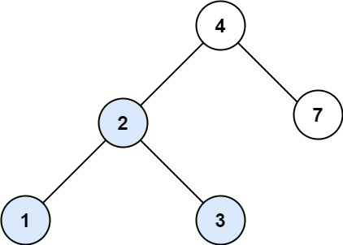
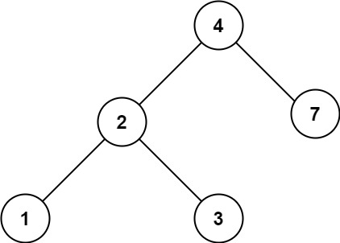

You are given the root of a binary search tree (BST) and an integer val.

Find the node in the BST that the node's value equals val and return the subtree rooted with that node. If such a node does not exist, return null.

 

Example 1:

Input: root = [4,2,7,1,3], val = 2
Output: [2,1,3]

Example 2:

Input: root = [4,2,7,1,3], val = 5
Output: []

https://leetcode.com/problems/search-in-a-binary-search-tree/